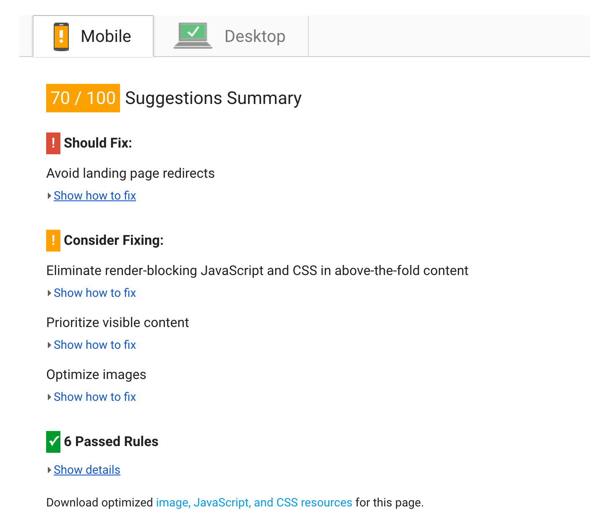

# Background

When my friend told me about the site, and I loaded it up on my iPhone 6 on wifi, I was staring at a white screen for possibly 8 seconds...which was weird, it didn't look like there was a lot to it. So I fired it up on my MBP over wifi again, and it wasn't that much different. So as you do...I looked at the network/timeline...and was astonished.

# Smell

To be clear, in order to render one static page with a handful of words and a couple of images

...we download the entire internet...

...as soon as I saw `react`, `mobx`, `lodash`, `bluebird`, `zepto` and ~181 other requests to render this one simple page, the die hard JS dev in me had to agree that there is such a thing as *too much JavaScript*.

Written with one of those "build your own website" things, the site is an example of _web destruction_, and gives the web it's bad name. In the tech bubble in which I live, *code splitting, critical css, the critical path in general, caching, service workers, PWAs, art direction, responsive/flex box/grid layout, progressive enhancement/graceful degradation, Web Share, page speed tools, CDNs, http/2 ad infinitum* are commonly discussed/known and implemented.

yet still...

You can pay money to get this:

[PageSpeed](https://developers.google.com/speed/pagespeed/insights/)

[Webpagetest](https://www.webpagetest.org/)

I've typically found you're waiting for ~1s just to get a response! Then my MBP chews through all that JS for ~2s giving you something ~4s. If I throttle it to 3g ......................................................................................................................................................................................................................................................................it takes ~18s of white screen, giving you the enjoyment of the logo at ~22s.

😭

# Static site generators

So here's my plan to provide something slightly better and for "FREE".

- [ ] Make site with [Hugo](https://gohugo.io/)
  - [ ] Compress images, provide optimised versions and move logo to SVG
  - [ ] Inline critical CSS
  - [ ] Make site responsive
  - [ ] Add a service worker
  - [ ] Only use JS where absolutely necessary
- [ ] Wire up to [AWS S3](https://aws.amazon.com/s3/) with [Codeship](https://codeship.com/)
- [ ] Add [CloudFront](https://aws.amazon.com/cloudfront/)
